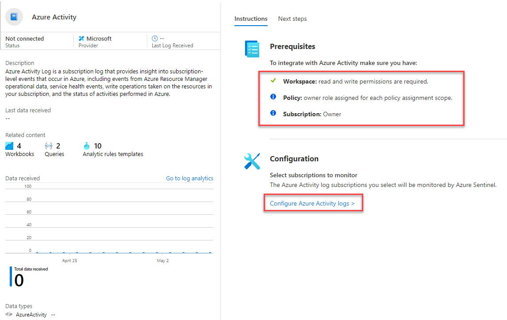

# LAB 02 - Data Connectors

#### 🎓 Level: 100 (Beginner)
#### ⌛ Estimated time to complete this lab: 15 minutes

## Objectives

In this guide you will learn how to enable Data Connectors in Azure Sentinel to bring alerts and/or telemtry from different sources.

#### Prerequisites

Some of the data connectors that will be used in this lab, require some specific permissions on the workspace or your azure subscription. If you don't have the appropriate permissions, you can still continue doing the rest of the labs.

### Exercise 1: Enable Azure Activity data connector

This exercise shows you how to enable the Azure Activity data connector. This connector will bring into your Azure Sentinel workspace all the audit events for actions performed in your Azure subscription.

**NOTE**: To do this exercise, your user must have Reader permissions to any subscription whose logs you want to stream into Azure Sentinel. 

1. Go to you Azure Sentinel workspace and select *Data Connectors* under *Configuration* section.

2. In the data connectors screen, type *actvity* in the search bar, select the *Azure Activity* connector and click on *Open connector page*.

3. In the Azure Activity connector page, check that your permissions are enough at the top, then click on *Configure Azure Activity logs*.

4. You will see a list of subscriptions which can be configured to send Azure audit logs to your workspace. Select one where your have at least Reader permission.

5. Click on *Connect* and wait until the operation completes.

6. In the upper right corner, click on the ✖ mark **twice** to return to the Azure Activity connector page.

7. Click on *Next Steps*. Here you see what content is available for the telemetry that is brought into Sentinel by this connector, like Workbooks, Query samples and Analytics Rules.

### Exercise 2: Enable Azure Defender data connector

This exercise shows you how to enable the Azure Defender data connector. This connector allows you to stream your security alerts from Azure Defender into Azure Sentinel, so you can view Defender data in workbooks, query it to produce alerts, and investigate and respond to incidents.

**NOTE**: To do this exercise, your user must have the Security Reader role in the subscription of the logs you stream. If not done already, you will need to enable Azure Defender within Azure Security Center.

1. Go to you Azure Sentinel workspace and select *Data Connectors* under *Configuration* section.

2. In the data connectors screen, type *defender* in the search bar, select the *Azure Defender* connector and click on *Open connector page*.

3. In the Azure Defender connector page, check that your permissions are enough at the top. If you don't have the required permissions, you can continue to the next exercise.

4. From the list of subscriptions at the bottom of the page, select the desired subscription an click on *Connect*. Wait for the operation to complete.

5. Click on *Next Steps* at the top of the page and explore what content is available for this connector.

### Exercise 3: Enable Threat Intelligence TAXII data connector

This exercise shows you how to enable the Threat Intelligence - TAXII data connector. This connector allows you to send send threat indicators from TAXII servers to Azure Sentinel. Threat indicators can include IP addresses, domains, URLs, and file hashes.

**NOTE**: To do this exercise, your user must have the Security Reader role in the subscription of the logs you stream. If not done already, you will need to enable Azure Defender within Azure Security Center.

1. Go to you Azure Sentinel workspace and select *Data Connectors* under *Configuration* section.

2. In the data connectors screen, type *taxii* in the search bar, select the *Threat intelligence - TAXII (Preview)* connector and click on *Open connector page*.

3. In the Threat Intelligence - TAXII connector page, add the following information under *Configuration* menu:

    - **Friendly name (for server)**: RansomwareIPs
    - **API root URL**: https://limo.anomali.com/api/v1/taxii2/feeds/
    - **Collection ID**: 135
    - **Username**: guest
    - **Password**: guest
    - **Import Indicators**: At most one month old (review all available options)
    - **Polling frequency**: Once an hour (review all available options)

4. Click *Add* and wait until the operation completes.

5. Click on *Next Steps* at the top of the page and explore what content is available for this connector. In a few seconds, the ThreatIntelligenceIndicator will be populated with IOCs from Anomali's feed.